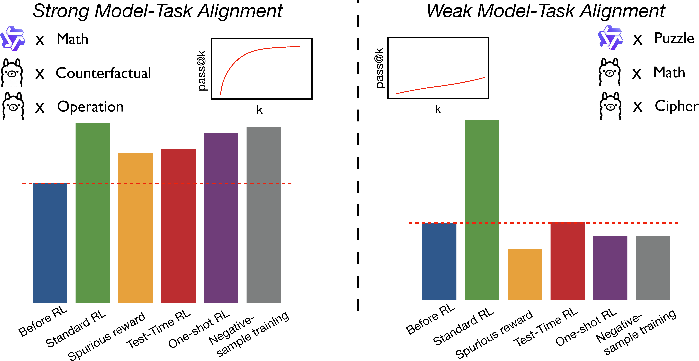

<div align="center">
    <h1>Mirage or Method? How Model–Task Alignment Induces Divergent RL Conclusions</h1>


[](https://arxiv.org/abs/2508.21188) [](https://opensource.org/licenses/MIT) 
</div>


## Table of contents

- [🌟Overview](#overview)
- [👀Get Started](#Get-Started)
  - [🔧Setup](#Setup)
  - [📚Data Processing](#Data-Processing)
  - [📉Reproducing](#Reproducing)
- [🚩Citation](#Citation)
- [🌻Acknowledgement](#Acknowledgement)

## 🌟Overview

Recent work reports striking but counter-intuitive LLM behaviors—e.g., one-shot training rivals full-dataset performance, noisy rewards suffice, and negative-only samples beat sophisticated reward-based methods—yet the conditions enabling or breaking these claims remain opaque. To this end, we propose three research questions:

1. How Critical is Reward Signal?
2. Is One-shot Enough for RL to Work?
3. Does RL Work with Only Negative Samples?

By answering these questions, we demonstrate that their validity hinges on a single factor: strong Model-Task Alignment, meas by the pretrained model’s pass@k on the target task. Across architectures and domains, we show that standard RL remains universally robust, whereas these surprising results emerge only when alignment is already high; when it is low, the same techniques collapse while RL still succeeds.

<div align="center">
    
</div>

## 👀Get Started

### 🔧Setup

You need to install [verl](https://github.com/volcengine/verl) first, we recommend referring to the [official tutorial](https://verl.readthedocs.io/en/latest/start/install.html). After that, you can run the following command to install the other required dependencies:

```bash
pip install -r requirements.txt
```

**[Optional]** You need to apply for access to the Llama 3.1 model parameters from [here](https://huggingface.co/meta-llama/Llama-3.1-8B-Instruct), which may take some time.

### 📚Data Processing

For logical tasks, we use SynLogic-Easy as the training data; you can download the complete dataset [here](https://huggingface.co/datasets/MiniMaxAI/SynLogic). We provide tools to convert it into the format supported by verl:

```bash
python src/logic_data_process.py --sub_set easy --local_dir /your/data/path
```

We also use [DeepScaleR](https://huggingface.co/datasets/agentica-org/DeepScaleR-Preview-Dataset) as our training set for math tasks, and you can run the following command to perform the format conversion:

```bash
python src/math_data_process.py --file_path /your/data/path/to/deepscaler.json
```

### 📉Reproducing

Our study encompasses three research questions and it includes a large number of experiments. We provide scripts in the `scripts` directory to reproduce them. This directory structure is:

```
scripts/
├── RQ1/
│   ├── qwen-math-ground_truth.sh
│   ├── qwen-logic-ground_truth.sh
│   ├── llama-math-ground-truth.sh
│   └── ...
├── RQ2/
│   ├── qwen-math.sh
│   ├── qwen-logic.sh
│   ├── llama-math.sh
│   └── llama-logic.sh
└── RQ3/
    ├── qwen-math-nsr.sh
    ├── qwen-math-psr.sh
    ├── qwen-logic-nsr.sh
    └── ...
```

You can examine the specific script files to obtain more details. To run these scripts successfully, you may need to replace certain parts of the code—for example, you’ll have to provide the path to your own dataset.

## 🚩Citation

If you find this repository helpful, feel free to cite our paper:

```bibtex
@misc{
}
```

## 🌻Acknowledgement

Our experiments are implemented on the basis of [verl](https://github.com/volcengine/verl). In particular, we would like to thank [SynLogic](https://github.com/MiniMax-AI/SynLogic) for providing the invaluable data and verifiers for the logical tasks.
